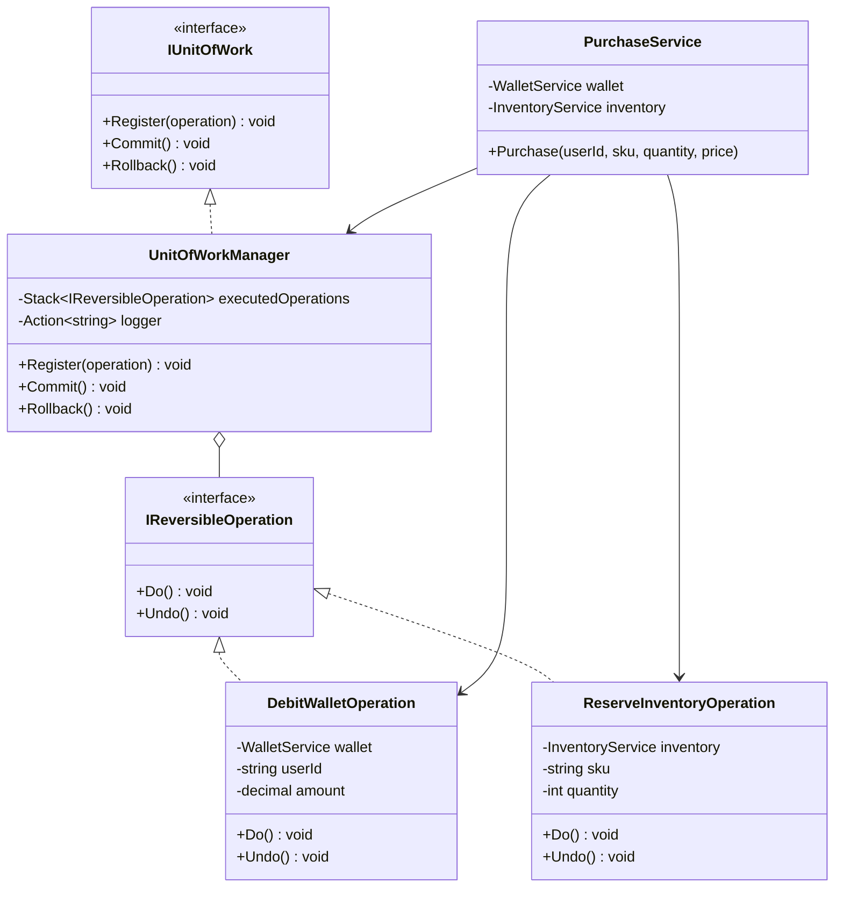
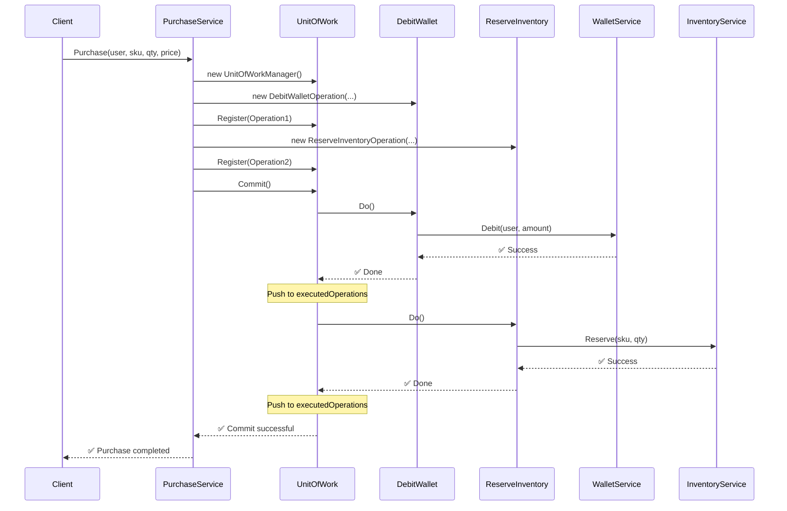
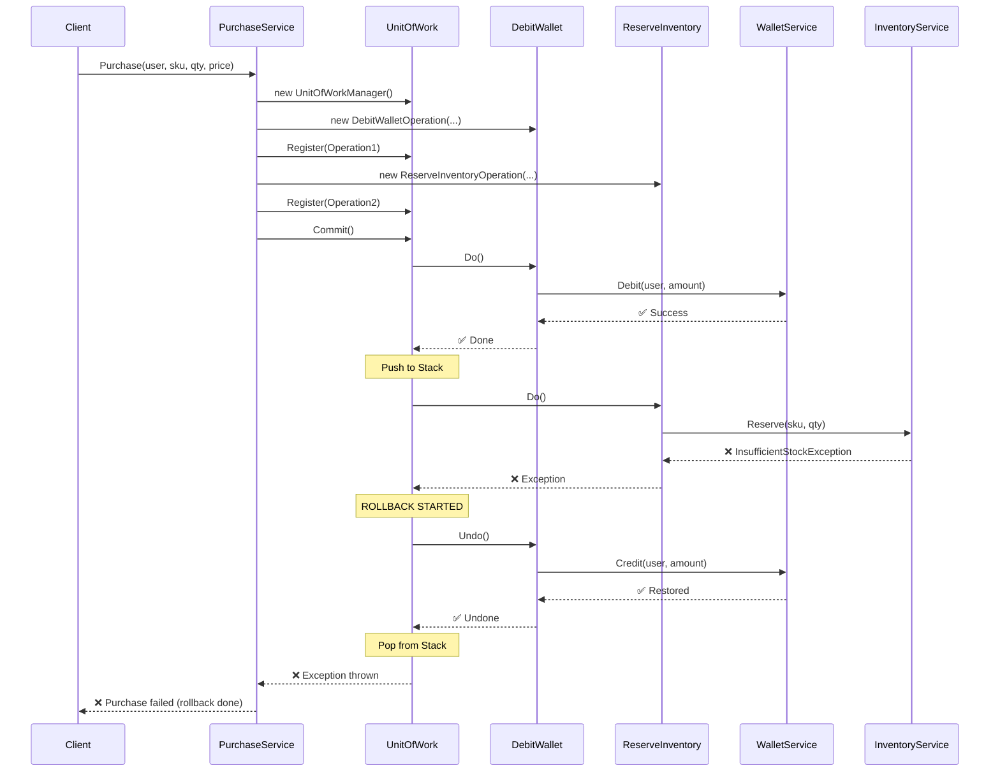
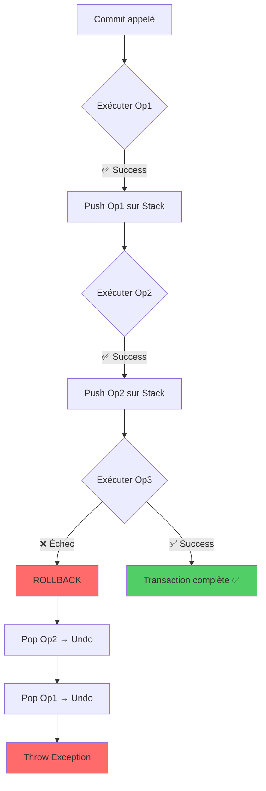
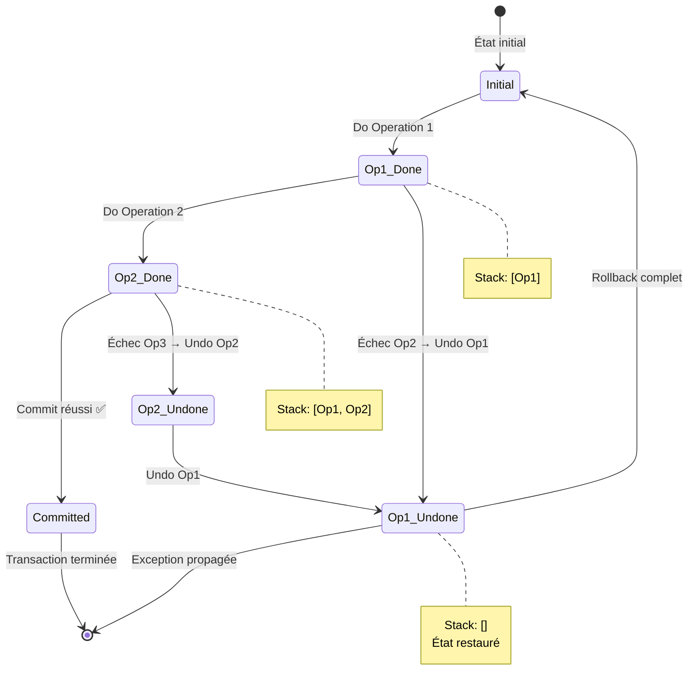
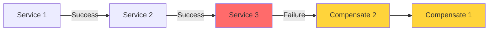

# Pattern Unit of Work avec Opérations Réversibles

## 📚 Vue d'ensemble

Le **Unit of Work** est un pattern architectural qui maintient une liste d'objets affectés par une transaction métier et coordonne l'écriture des changements. Il garantit que soit **toutes les opérations réussissent**, soit **aucune ne s'applique** (principe ACID).

Dans cette implémentation, nous combinons le Unit of Work avec le **pattern Command** et des **opérations réversibles** (Do/Undo) pour permettre un rollback automatique en cas d'échec.

## 🎯 Problème résolu

### Sans Unit of Work

```
❌ Opération 1 : Débiter le portefeuille → ✅ Réussit
❌ Opération 2 : Réserver le stock → ❌ ÉCHEC (stock insuffisant)

Résultat : Le portefeuille est débité mais le stock n'est pas réservé
          → État incohérent !
```

### Avec Unit of Work

```
✅ Opération 1 : Débiter le portefeuille → ✅ Réussit
✅ Opération 2 : Réserver le stock → ❌ ÉCHEC
   → Rollback automatique
   → Undo Opération 1 : Créditer le portefeuille

Résultat : Toutes les modifications sont annulées
          → État cohérent !
```

## 🏗️ Architecture

### Diagramme de classes



## 🔄 Flux d'exécution

### Scénario de succès



### Scénario avec rollback



## 🔧 Composants clés

### 1. Interface IReversibleOperation

Définit le contrat pour les opérations réversibles :

```csharp
public interface IReversibleOperation
{
    void Do();    // Exécute l'opération
    void Undo();  // Annule l'opération
}
```

**Principe** : Chaque opération doit savoir comment s'exécuter ET comment s'annuler.

### 2. Interface IUnitOfWork

Définit le contrat pour le gestionnaire de transactions :

```csharp
public interface IUnitOfWork
{
    void Register(IReversibleOperation operation);  // Ajoute une opération
    void Commit();                                  // Exécute tout
    void Rollback();                                // Annule tout
}
```

### 3. UnitOfWorkManager

Implémentation concrète qui :

- **Enregistre** les opérations dans l'ordre
- **Exécute** toutes les opérations séquentiellement
- **Empile** les opérations réussies dans une Stack
- **Rollback** en dépilant et en appelant Undo() en ordre inverse



### 4. Opérations concrètes

#### DebitWalletOperation

```csharp
public class DebitWalletOperation : IReversibleOperation
{
    public void Do()   => wallet.Debit(userId, amount);   // Retire l'argent
    public void Undo() => wallet.Credit(userId, amount);  // Remet l'argent
}
```

#### ReserveInventoryOperation

```csharp
public class ReserveInventoryOperation : IReversibleOperation
{
    public void Do()   => inventory.Reserve(sku, quantity);  // Réserve le stock
    public void Undo() => inventory.Release(sku, quantity);  // Libère le stock
}
```

## 🎨 État des données pendant le cycle



## 📊 Exemple concret

### Configuration initiale

```
Portefeuille de Alice : 100€
Stock de "Laptop" : 5 unités
```

### Achat réussi

```csharp
purchaseService.Purchase("Alice", "Laptop", 2, 50.00m);
```

**Étapes** :

1. ✅ Débiter 100€ du portefeuille d'Alice → Solde : 0€
2. ✅ Réserver 2 "Laptop" → Stock : 3 unités
3. ✅ **Commit réussi**

**Résultat final** :

```
Portefeuille de Alice : 0€      (100 - 100 = 0)
Stock de "Laptop" : 3 unités    (5 - 2 = 3)
```

### Achat avec rollback

```csharp
purchaseService.Purchase("Alice", "Laptop", 10, 50.00m);
```

**Étapes** :

1. ✅ Débiter 500€ → Temporairement : -400€
2. ❌ Réserver 10 "Laptop" → **ÉCHEC** (stock = 3 < 10)
3. 🔄 **Rollback automatique**
   - Undo : Créditer 500€ → Solde restauré : 100€

**Résultat final** :

```
Portefeuille de Alice : 100€    (Restauré à l'état initial)
Stock de "Laptop" : 3 unités    (Aucun changement)
Exception : InsufficientStockException
```

## ✅ Avantages du pattern

| Avantage | Description |
|----------|-------------|
| **🔒 Cohérence** | Garantit que les données restent cohérentes (tout ou rien) |
| **🔄 Réversibilité** | Rollback automatique sans code conditionnel complexe |
| **📦 Encapsulation** | Chaque opération est isolée et testable individuellement |
| **🧩 Extensibilité** | Facile d'ajouter de nouvelles opérations réversibles |
| **🧪 Testabilité** | Chaque composant peut être testé en isolation |
| **📊 Traçabilité** | Logger optionnel pour suivre l'exécution et le rollback |

## 🎯 Cas d'usage

- **Transactions bancaires** : Transfert entre comptes
- **E-commerce** : Achat avec paiement + réservation de stock
- **Réservations** : Hôtel/vol avec paiement
- **Systèmes distribués** : Opérations multi-services (Saga pattern)
- **Gestion de ressources** : Allocation/libération atomique
- **Workflows métier** : Processus en plusieurs étapes

## 🚀 Extensions possibles

### 1. Opérations asynchrones

```csharp
public interface IReversibleOperationAsync
{
    Task DoAsync();
    Task UndoAsync();
}
```

### 2. Gestion des compensations partielles

Certaines opérations ne peuvent pas être complètement annulées (ex: email envoyé). On peut alors :

- Logger les actions pour audit
- Envoyer une notification de compensation
- Marquer l'opération comme "compensée partiellement"

### 3. Retry automatique

```csharp
public class RetryableUnitOfWork : IUnitOfWork
{
    private readonly int maxRetries = 3;
    
    public void Commit()
    {
        for (int i = 0; i < maxRetries; i++)
        {
            try
            {
                CommitInternal();
                return;
            }
            catch (TransientException ex)
            {
                if (i == maxRetries - 1) throw;
                Rollback();
            }
        }
    }
}
```

### 4. Saga pattern distribué

Pour des opérations sur plusieurs microservices :



## 📚 Références

- **Martin Fowler** - Patterns of Enterprise Application Architecture
- **Domain-Driven Design** - Eric Evans
- **Saga Pattern** - Microservices patterns
- **ACID Transactions** - Database theory

## 🎓 Concepts liés

- **Command Pattern** : Encapsulation d'une requête comme objet
- **Memento Pattern** : Sauvegarde et restauration d'état
- **Transaction Script** : Logique métier organisée par transaction
- **Repository Pattern** : Abstraction de la couche de persistance
- **Two-Phase Commit** : Protocole de transaction distribuée

---

**💡 Principe clé** : "Une transaction métier doit réussir complètement ou échouer complètement, sans laisser le système dans un état incohérent."
